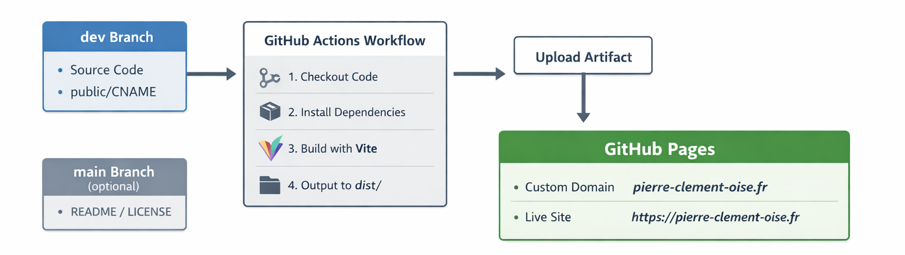

# Portfolio - Pierre Clément

Welcome to my personal portfolio website built with **React + Vite** and deployed on **GitHub Pages**.

## Live Site

[https://pierre-clement-oise.fr](https://pierre-clement-oise.fr)

## Project Overview

This project showcases my work and skills as a developer. It is built with:

- **React** for UI
- **Vite** as the build tool
- **GitHub Actions** for CI/CD
- **GitHub Pages** for hosting
- SPA routing handled for smooth navigation

---

## CI/CD Workflow

The site is automatically built and deployed whenever changes are pushed to the `dev` branch. The `main` branch is optional and contains only documentation (README/LICENSE).  

Below is a visual representation of the workflow:



**Workflow Steps:**

1. Push code to `dev` branch  
2. GitHub Actions:
   - Checkout code
   - Install dependencies
   - Build Vite app (`npm run build`)
   - Upload `dist/` folder as artifact
   - Deploy to GitHub Pages
3. GitHub Pages serves the site at your custom domain.

---

## Branch Structure

- **dev**: Source code, triggers build & deployment  
- **main**: Optional, only README/LICENSE, not used for deployment  

---

## Deployment

- **GitHub Actions** automatically handles CI/CD  
- **Custom Domain**: `pierre-clement-oise.fr` via `public/CNAME`  
- **Vite `base` configuration**: set to `/` for custom domain

---

## Local Setup

To run the project locally:

```bash
git clone https://github.com/KadenHD/portfolio.git
git checkout dev
npm install
npm run dev
```

To build locally:

```bash
npm run build
```

---

## Notes

- `dist/` is never committed; CI/CD handles deployment
- CNAME file must be in `public/` for custom domain
- `main` branch is safe to have README/LICENSE only

---

## License

[MIT License](./LICENSE)
